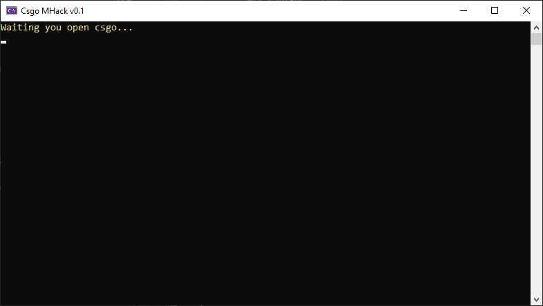
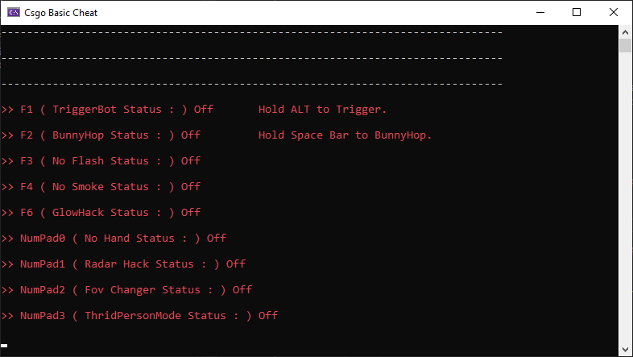

## ELgo

This is a cheat tool for CS:GO, created using Microsoft Visual Studio (C++).

### Purpose

This project was created for technical and stand-alone use. It was not intended for widespread distribution or use in competitive play but rather as a personal exploration into game modifications and automation.

## Update for 2024

I developed this script during high school (F3-F4, 2018-2019). Previously, this project was closed-source, but I’ve decided to make it open-source now.

### Will You Continue Development?

Since I’ve been using GNU/Linux as my daily driver for a long time, Windows software is no longer a priority for me. Therefore, I won’t be focusing on Windows-related updates. In short, the answer is `No`.

To be honest, the game that was dear to my heart has already been taken down. Even if CS2 becomes available on Proton while supports GNU/Linux, I probably won’t create cheats again. If circumstances change, this project might commit again, but for now, there will be no further development.

## Features

Here’s a list of the features included in this CS:GO cheat:

- **Trigger Bot** - Press F1 to toggle, hold ALT to trigger
- **BunnyHop** - Press F2 to toggle, hold SPACE to bunnyhop
- **Anti-Flash** - Press F3 to toggle
- **Anti-Smoke** - Press F4 to toggle
- **No Hand** - Press NumPad0 to toggle
- **Radar Hack** - Press NumPad1 to toggle
- **FOV Changer** - Press NumPad2 to toggle
- **Enable 3rd Person Mode** - Press NumPad3 to toggle

